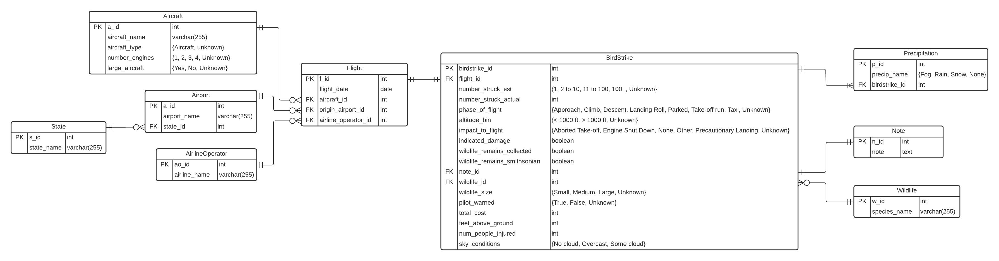

# Practicum 1
## Design, Implement, and Load a Relational Database

### Project Overview
For our first practicum, @tolliverdani worked together to review and understand an FAA data set of bird strikes. Using that information, we design a relational database to store the data in BCNF. We then built the database, hosted on AWS, using R Studio. Finally, we cleaned, transformed, and loaded the data into the database.

### Final ERD

