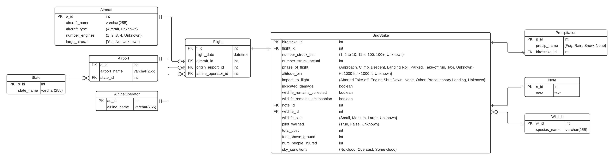

# ERD

 <https://lucid.app/lucidchart/invitations/accept/inv_5008b57e-c7a0-403b-acf6-4c4c93856462?viewport_loc=-1270%2C-1079%2C2519%2C1721%2C2qcOW-XE2nwP>

# Load Libraries

```{r}
library(RMySQL)
library(sqldf)
library(lubridate)
library(dplyr)
library(data.table)
library(ggplot2)
library(tinytex)

options(sqldf.driver = "SQLite")
```

# Connecting to the AWS database

```{r}
db_user <- "admin"
db_password <- "Boston1234"
db_name <-"practicum1db"
db_host <- "practicum1.c9h321ihmn93.us-east-2.rds.amazonaws.com"
db_port <- 3306

mydb <- dbConnect(MySQL(), dbname = db_name, host = db_host, port = db_port,
                  user = db_user, password = db_password)
```

```{r}
# View tables in the database
dbListTables(mydb)
```

```{sql connection=mydb}
-- Turns off foreign key check
SET FOREIGN_KEY_CHECKS = 0;
```

# Creating the tables

## CREATE TABLE: Aircraft

```{sql connection=mydb}
DROP TABLE IF EXISTS Aircraft;
```

```{sql connection=mydb}
CREATE TABLE Aircraft(
  a_id INTEGER PRIMARY KEY AUTO_INCREMENT,
  aircraft_name VARCHAR(255) UNIQUE NOT NULL,      -- TODO: We added unique here
  aircraft_type ENUM('Airplane', 'UNKNOWN') NOT NULL,
  number_engines ENUM('1', '2', '3', '4', '5', '6', '7', '8', 'UNKNOWN') NOT NULL,
  large_aircraft ENUM('Yes', 'No', 'UNKNOWN') NOT NULL
  );
  
-- assumption: we are assuming that each model for the airplane has only one engine configuration so we are correcting for it before uploading the table using a mode calculation. 
```

```{sql connection=mydb}
SELECT * FROM Aircraft;
```

## CREATE TABLE: State

```{sql connection=mydb}
DROP TABLE IF EXISTS State;
```

```{sql connection=mydb}
CREATE TABLE State(
  s_id INTEGER PRIMARY KEY AUTO_INCREMENT,
  state_name VARCHAR(255) UNIQUE NOT NULL
  );
```

```{sql connection=mydb}
SELECT * FROM State;
```

## CREATE TABLE: Airport

```{sql connection=mydb}
DROP TABLE IF EXISTS Airport;
```

```{sql connection=mydb}
CREATE TABLE Airport(
  a_id INTEGER PRIMARY KEY AUTO_INCREMENT,
  airport_name VARCHAR(255) NOT NULL,
  state_id INTEGER NOT NULL,
  CONSTRAINT state_id_fk FOREIGN KEY (state_id) REFERENCES State(s_id)
  );
```

```{sql connection=mydb}
SELECT * FROM Airport;
```

## CREATE TABLE: AirlineOperator

```{sql connection=mydb}
DROP TABLE IF EXISTS AirlineOperator;
```

```{sql connection=mydb}
CREATE TABLE AirlineOperator(
  ao_id INTEGER PRIMARY KEY AUTO_INCREMENT,
  airline_name VARCHAR(255) UNIQUE NOT NULL
  );
```

```{sql connection=mydb}
SELECT * FROM AirlineOperator;
```

## CREATE TABLE: Flight

```{sql connection=mydb}
DROP TABLE IF EXISTS Flight;
```

```{sql connection=mydb}
CREATE TABLE Flight(
  f_id INTEGER PRIMARY KEY AUTO_INCREMENT,
  flight_date DATE NOT NULL,
  aircraft_id INTEGER NOT NULL,
  origin_airport_id INTEGER NOT NULL,
  airline_operator_id INTEGER NOT NULL,
  CONSTRAINT aircraft_id_fk FOREIGN KEY (aircraft_id) REFERENCES Aircraft(a_id),
  CONSTRAINT origin_airport_id_fk FOREIGN KEY (origin_airport_id) REFERENCES Airport(a_id),
  CONSTRAINT airline_operator_id_fk FOREIGN KEY (airline_operator_id) REFERENCES AirlineOperator(ao_id)
  );
```

```{sql connection=mydb}
SELECT * FROM Flight;
```

## CREATE TABLE: Wildlife

```{sql connection=mydb}
DROP TABLE IF EXISTS Wildlife;
```

```{sql connection=mydb}
CREATE TABLE Wildlife(
  w_id INTEGER PRIMARY KEY AUTO_INCREMENT,
  species_name VARCHAR(255) UNIQUE NOT NULL
  );
```

```{sql connection=mydb}
SELECT * FROM Wildlife;
```

## CREATE TABLE: Note

```{sql connection=mydb}
DROP TABLE IF EXISTS Note;
```

```{sql connection=mydb}
CREATE TABLE Note(
  n_id INTEGER PRIMARY KEY AUTO_INCREMENT,
  note TEXT NOT NULL
  );
```

```{sql connection=mydb}
SELECT * FROM Note;
```

## CREATE TABLE: BirdStrike

```{sql connection=mydb}
DROP TABLE IF EXISTS BirdStrike;
```

```{sql connection=mydb}
CREATE TABLE BirdStrike(
  birdstrike_id INTEGER PRIMARY KEY AUTO_INCREMENT,
  flight_id INTEGER NOT NULL,
  number_struck_est ENUM('1', '2 to 10', '11 to 100', '100+', 'UNKNOWN') NOT NULL,
  number_struck_actual INTEGER NOT NULL,
  phase_of_flight ENUM('Approach', 'Climb', 'Descent', 'Landing Roll', 
                       'Parked', 'Take-off run', 'Taxi', 'UNKNOWN') NOT NULL,
  altitude_bin ENUM('< 1000 ft', '> 1000 ft', 'UNKNOWN') NOT NULL,
  impact_to_flight ENUM('Aborted Take-off', 'Engine Shut Down', 'None', 
                        'Other', 'Precautionary Landing', 'UNKNOWN') NOT NULL,
  indicated_damage BOOLEAN NOT NULL,
  wildlife_remains_collected BOOLEAN NOT NULL,
  wildlife_remains_smithsonian BOOLEAN NOT NULL,
  note_id INTEGER NOT NULL,
  wildlife_id INTEGER NOT NULL,
  wildlife_size ENUM('Small', 'Medium', 'Large', 'UNKNOWN') NOT NULL,
  pilot_warned ENUM('True', 'False', 'UNKNOWN') NOT NULL,
  total_cost INTEGER NOT NULL,
  feet_above_ground INTEGER NOT NULL,
  num_people_injured INTEGER NOT NULL,
  sky_conditions ENUM('No cloud', 'Overcast', 'Some cloud') NOT NULL,
  CONSTRAINT flight_id_fk FOREIGN KEY (flight_id) REFERENCES Flight(f_id),
  CONSTRAINT note_fk FOREIGN KEY (note_id) REFERENCES Note(n_id),
  CONSTRAINT wildlife_id_fk FOREIGN KEY (wildlife_id) REFERENCES Wildlife(w_id)
  );
```

```{sql connection=mydb}
SELECT * FROM BirdStrike;
```

## CREATE TABLE: Precipitation

```{sql connection=mydb}
DROP TABLE IF EXISTS Precipitation;
```

```{sql connection=mydb}
CREATE TABLE Precipitation(
  p_id INTEGER PRIMARY KEY AUTO_INCREMENT,
  precip_name ENUM('Fog', 'Rain', 'Snow', 'None') NOT NULL,
  birdstrike_id INTEGER NOT NULL,
  CONSTRAINT birdstrike_id_fk FOREIGN KEY (birdstrike_id) REFERENCES BirdStrike(birdstrike_id)
  );
```

```{sql connection=mydb}
SELECT * FROM Precipitation;
```

# Cleaning the Data

## Load CSV File

```{r}
# Saved a copy of birdstrikes.csv to our git repo
file <- "BirdStrikesData.csv"

# to remove the blanks and update with UNKNOWN
birdStrike_df <- read.csv(file, header = TRUE, stringsAsFactors = FALSE, na.strings=c("", " "))
birdStrike_df[is.na(birdStrike_df)] <- 'UNKNOWN'

# make the row names a column for each row, which will be needed for loading data
setDT(birdStrike_df, keep.rownames = TRUE)[] 
names(birdStrike_df)[names(birdStrike_df) == "rn"] <- "UniqueKey"
names(birdStrike_df)[names(birdStrike_df) == "ï..Record.ID"] <- "Record.ID"
head(birdStrike_df)
```

## Parsing Date

```{r}
# If needed, this is used to drop the parsed_date column
# birdStrike_df = subset(birdStrike_df, select = -c(flight_date) )
```

```{r}
# If value was uploaded as UNKNOWN, set the date to 1/1/1776. Otherwise, parse the date as is.
for (row in 1:nrow(birdStrike_df)){
  date_time_string <- unlist(birdStrike_df[row, "FlightDate"])
  if (date_time_string == "UNKNOWN"){
    date_time_parsed <- as.Date(as.character(as.POSIXct("1/1/1776 0:00", format="%m/%d/%Y %H:%M")))
  } else {
    date_time_parsed <- as.Date(as.character(as.POSIXct(date_time_string, format="%m/%d/%Y %H:%M")))
  }
  birdStrike_df[row, "flight_date"] <- date_time_parsed
}

# Assumption: for unknown dates, it is set to 1776
```

```{r}
# SQL command to confirm that data was correctly pulled
date_confirmation <- sqldf('SELECT "UniqueKey", "FlightDate"
                           , "flight_date" 
                           FROM birdStrike_df')
head(date_confirmation)
```

## Cleaning Wildlife

```{r}
# Copy over size where "Unknown bird - SIZE" was listed. Also standardize "UNKNOWN"
birdStrike_df$Wildlife..Size[birdStrike_df$Wildlife..Species == "Unknown bird - small"] <- "Small"
birdStrike_df$Wildlife..Size[birdStrike_df$Wildlife..Species == "Unknown bird - medium"] <- "Medium"
birdStrike_df$Wildlife..Size[birdStrike_df$Wildlife..Species == "Unknown bird - large"] <- "Large"

birdStrike_df$Wildlife..Species[birdStrike_df$Wildlife..Species == "Unknown bird - small"] <- "UNKNOWN"
birdStrike_df$Wildlife..Species[birdStrike_df$Wildlife..Species == "Unknown bird - medium"] <- "UNKNOWN"
birdStrike_df$Wildlife..Species[birdStrike_df$Wildlife..Species == "Unknown bird - large"] <- "UNKNOWN"
birdStrike_df$Wildlife..Species[birdStrike_df$Wildlife..Species == "Unknown bird or bat"] <- "UNKNOWN"
```

## Cleaning BirdStrike

```{r}
# Change Y or N to True or False
birdStrike_df$Pilot.warned.of.birds.or.wildlife.[birdStrike_df$Pilot.warned.of.birds.or.wildlife. == "Y"] <- "True"
birdStrike_df$Pilot.warned.of.birds.or.wildlife.[birdStrike_df$Pilot.warned.of.birds.or.wildlife. == "N"] <- "False"
```

# Uploading the Data

## PREPARE DATA: AirlineOperator

```{r}
AirlineOperatorTable <- sqldf('SELECT DISTINCT "Aircraft..Airline.Operator" AS airline_name 
                               FROM birdStrike_df
                               ORDER BY airline_name')
head(AirlineOperatorTable)
```

```{r}
# Upload data
dbWriteTable(mydb, "AirlineOperator", AirlineOperatorTable, row.names = FALSE, append = TRUE)
```

## PREPARE DATA: State

```{r}
# Retrieve Data
StateTable <- sqldf('SELECT DISTINCT "Origin.State" AS state_name
                     FROM birdStrike_df
                     ORDER BY state_name')
head(StateTable)
```

```{r}
dbWriteTable(mydb, "State", StateTable, row.names = FALSE, append = TRUE)
```

## PREPARE DATA: Airport

```{r}
# Query State Data from Database
stateDataFromDatabase <- dbGetQuery(mydb, "SELECT * FROM State;")

# Join query from Database with query from birdStrike_df
stateDataTemp <- sqldf('SELECT DISTINCT "Airport..Name" AS airport_name
                       , s_id AS state_id
                       FROM birdStrike_df
                       JOIN stateDataFromDatabase
                       ON "Origin.State" = state_name')

# Use SQLDF to query only columns needed, labeled as needed
airportTable <- sqldf('SELECT DISTINCT airport_name
                     , state_id
                     FROM stateDataTemp
                     ORDER BY airport_name')
head(airportTable)
```

```{r}
dbWriteTable(mydb, "Airport", airportTable, row.names = FALSE, append = TRUE)
```

## PREPARE DATA: Aircraft

```{r}
# Query df to generate list of aircraft and numengines
AircraftNumEnginesOnlyDF <- sqldf('SELECT "Aircraft..Make.Model" AS Aircraft,
                                  "Aircraft..Number.of.engines." AS NumEngines
                                  FROM birdStrike_df
                                  ORDER BY Aircraft')

# Create summary table and then convert it back to dataframe
AircraftNumEnginesOnlyTable <- table(AircraftNumEnginesOnlyDF)

# Convert the table back to df
AircraftNumEnginesOnlyDF2 <- as.data.frame.matrix(AircraftNumEnginesOnlyTable)

# Find the max values for each column and add as new column
max_values <- colnames(AircraftNumEnginesOnlyDF2)[max.col(AircraftNumEnginesOnlyDF2, ties.method = "first")]
AircraftNumEnginesOnlyDF2$most_common_engine <- max_values

# Add airplane name as column, not row identifier
setDT(AircraftNumEnginesOnlyDF2, keep.rownames = TRUE)[]

# Query above table to retrieve needed format
AircraftTableEnginesOnly <- sqldf('SELECT rn AS name
                                  , most_common_engine AS number_engines 
                                  FROM AircraftNumEnginesOnlyDF2')

# Query dataframe to pull in large_aircraft attribute for each aircraft
AircraftTableLargeAircraft <- sqldf('SELECT DISTINCT "Aircraft..Make.Model" AS name,
                                    "Aircraft..Type" AS aircraft_type,
                                    "Is.Aircraft.Large." AS large_aircraft
                                    FROM birdStrike_df
                                    GROUP BY name')

# Union df that has engine setup with df that has aircraft_type and large_aircraft
AircraftTable <- sqldf('SELECT rest.name AS aircraft_name
                       , rest.aircraft_type
                       , engines.number_engines
                       , rest.large_aircraft
                       FROM AircraftTableLargeAircraft AS rest
                       JOIN AircraftTableEnginesOnly AS engines
                       ON rest.name = engines.name
                       ORDER BY rest.name')
head(AircraftTable)
```

```{r}
dbWriteTable(mydb, "Aircraft", AircraftTable, row.names = FALSE, append = TRUE)
```

## PREPARE DATA: Flight

```{r}
# Query information from database, needed to join everything together
AircraftFromAWS <- dbGetQuery(mydb, "SELECT * FROM Aircraft;")
AirportFromAWS <- dbGetQuery(mydb, "SELECT * FROM Airport;")
AirlineOperatorFromAWS <- dbGetQuery(mydb, "SELECT * FROM AirlineOperator;")
StateFromAWS <- dbGetQuery(mydb, "SELECT * FROM State;")
```

```{r}
# Start by joining in Aircraft data
FlightTableWithAircraft <- sqldf('SELECT "UniqueKey" as f_id
                                  , "Record.ID" AS record_id
                                  , flight_date
                                  , aircraft.a_id AS aircraft_id
                                  , aircraft.aircraft_name AS aircraft_name
                                  , "Airport..Name" AS airport_name
                                  , "Origin.State" AS origin_state
                                  , "Aircraft..Airline.Operator"
                                  FROM birdStrike_df
                                  JOIN AircraftFromAWS AS aircraft
                                  ON "Aircraft..Make.Model" = aircraft.aircraft_name')

# Then add in state
FlightTableWithAircraft_State <- sqldf('SELECT *
                                        FROM FlightTableWithAircraft
                                        JOIN StateFromAWS
                                        ON origin_state = state_name')


# Then add in airline operator
FlightTableWithAircraft_AirlineOperator <- sqldf('SELECT *
                                                FROM FlightTableWithAircraft_State
                                                JOIN AirlineOperatorFromAWS AS airlineOperator
                                                ON "Aircraft..Airline.Operator" = airlineOperator.airline_name')

# Then add in airport
FlightTable <- sqldf('SELECT f_id, flight_date
                     , aircraft_id, a_id AS origin_airport_id
                     , ao_id AS airline_operator_id
                     FROM FlightTableWithAircraft_AirlineOperator
                     JOIN AirportFromAWS AS airport
                     ON FlightTableWithAircraft_AirlineOperator.airport_name = airport.airport_name AND airport.state_id = s_id')
head(FlightTable)
```

```{r}
dbWriteTable(mydb, "Flight", FlightTable, row.names = FALSE, append = TRUE)
```

## PREPARE DATA: Note

```{r}
NoteTable <- sqldf('SELECT "UniqueKey" AS n_id, "Remarks" AS note
                       FROM birdStrike_df')
head(NoteTable)
```

```{r}
dbWriteTable(mydb, "Note", NoteTable, row.names = FALSE, append = TRUE)
```

## PREPARE DATA: Wildlife

```{r}
WildlifeTable <- sqldf('SELECT DISTINCT "Wildlife..Species" AS species_name
                        FROM birdStrike_df')
head(WildlifeTable)
```

```{r}
dbWriteTable(mydb, "Wildlife", WildlifeTable, row.names = FALSE, append = TRUE)
```

## PREPARE DATA: BirdStrike

```{r}
# Query database to get necessary information to join birdstrike table
WildlifeFromAWS <- dbGetQuery(mydb, "SELECT * FROM Wildlife;")
```

```{r}
BirdStrikeTable <- sqldf('SELECT "Record.ID" as birdstrike_id
                         , "UniqueKey" AS flight_id
                         , "Wildlife..Number.struck" as number_struck_est
                         , "Wildlife..Number.Struck.Actual" as number_struck_actual
                         , "When..Phase.of.flight" as phase_of_flight
                         , "Altitude.bin" as altitude_bin
                         , "Effect..Impact.to.flight" as impact_to_flight
                         , "Effect..Indicated.Damage" as indicated_damage
                         , "Remains.of.wildlife.collected." as wildlife_remains_collected
                         , "Remains.of.wildlife.sent.to.Smithsonian" as wildlife_remains_smithsonian
                         , "Wildlife..Size" as wildlife_size
                         , "UniqueKey" as note_id
                         , wildlife.w_id as wildlife_id
                         , "Pilot.warned.of.birds.or.wildlife." as pilot_warned
                         , "Cost..Total.." as total_cost
                         , "Feet.above.ground" as feet_above_ground
                         , "Number.of.people.injured" as num_people_injured
                         , "Conditions..Sky" as sky_conditions
                         FROM birdStrike_df
                         JOIN WildlifeFromAWS AS wildlife
                         ON "Wildlife..Species" = wildlife.species_name')
head(BirdStrikeTable)
```

```{r}
dbWriteTable(mydb, "BirdStrike", BirdStrikeTable, row.names = FALSE, append = TRUE)
```

## PREPARE DATA: Precipitation

```{r}
strike_and_precip <- sqldf('SELECT "Record.ID" AS birdstrike_id, "Conditions..Precipitation" AS precip_name
                              FROM birdStrike_df')
head(strike_and_precip)
```

```{r}
# Create an empty preciptable
PrecipTable <- data.frame(matrix(ncol = 2, nrow = 0))
col_names <- c("birdstrike_id", "precip_name")
colnames(PrecipTable) <- col_names

# iterate through each row in the df to parse multi-valued atributes to unique columns
for (row in 1:nrow(strike_and_precip)){
  record_id <- strike_and_precip[row, "birdstrike_id"]
  precip_parsed <- unlist(strsplit(strike_and_precip[row, "precip_name"], "\\,\ "))
  for (precip in precip_parsed){
    new_row <- c(record_id, precip)
    PrecipTable <- rbind(new_row, PrecipTable)
  }
}

# add back column names
colnames(PrecipTable) <- col_names
head(PrecipTable)
```

```{r}
dbWriteTable(mydb, "Precipitation", PrecipTable, row.names = FALSE, append = TRUE)
```

```{sql connection=mydb}
-- Turns on foreign key check now that data is uploaded
SET FOREIGN_KEY_CHECKS = 1;
```

# Practicum Questions

### 4. (10 pts / 1 hr) Create a SQL query against your database to find the number of bird strike incidents for each airline upon take-off or climb. Include all airlines. You may either use a {sql} code chunk or an R function to execute the query.

```{sql connection=mydb}
SELECT COUNT(BirdStrike.birdstrike_id) AS incidents
, airline_name
FROM BirdStrike
JOIN Flight
ON BirdStrike.flight_id = Flight.f_id
JOIN AirlineOperator
ON airline_operator_id = ao_id
WHERE phase_of_flight IN ('Take-off run', 'Climb') AND airline_name <> "UNKNOWN"
GROUP BY airline_name
ORDER BY incidents DESC
```

### 5. (10 pts / 1 hr) Create a SQL query against your database to find the airports that had the most bird strike incidents (during any flight phase). Include all airlines. You may either use a {sql} code chunk or an R function to execute the query.

```{sql connection=mydb}
SELECT COUNT(BirdStrike.birdstrike_id) AS incidents
, airport_name
FROM BirdStrike
JOIN Flight
ON BirdStrike.flight_id = Flight.f_id
JOIN Airport
ON origin_airport_id = a_id
GROUP BY airport_name
ORDER BY incidents DESC
```

### 6. (10 pts / 1 hr) Create a SQL query against your database to find the number of bird strike incidents by year. Include all airlines. You may either use a {sql} code chunk or an R function to execute the query.

```{sql connection=mydb}
SELECT COUNT(BirdStrike.birdstrike_id) AS incidents
, YEAR(Flight.flight_date) AS Year
FROM BirdStrike
JOIN Flight
ON BirdStrike.flight_id = Flight.f_id
WHERE YEAR(Flight.flight_date) <> "1776"
GROUP BY YEAR(Flight.flight_date)
ORDER BY Year 
```

### 7. (10 pts / 3 hrs) Using the above data, build a column chart that visualizes the number of bird strikes incidents per year from 2008 to 2011 during take-off/climbing and during descent/approach/landing. Adorn the graph with appropriate axis labels.

```{r}
# pulling the data together into a data frame
BirdstrikesPerYear <- dbGetQuery(mydb, 
                            'SELECT * FROM 
                            (SELECT COUNT(BirdStrike.birdstrike_id) as incidents
                            , CASE 
                              WHEN phase_of_flight = "Take-off run" THEN "Ascent"
                              WHEN phase_of_flight = "Climb" THEN "Ascent"
                              WHEN phase_of_flight = "Descent" THEN "Descent"
                              WHEN phase_of_flight = "Approach" THEN "Descent"
                              WHEN phase_of_flight = "Landing Roll" THEN "Descent"
                            END as phase
                            , YEAR(Flight.flight_date) as Year
                            FROM BirdStrike
                            JOIN Flight
                            ON BirdStrike.flight_id = Flight.f_id
                            WHERE YEAR(Flight.flight_date) >= 2008
                            and YEAR(Flight.flight_date) <= 2011
                            GROUP BY YEAR(Flight.flight_date), phase
                            ORDER BY Year) t
                            WHERE phase = ("Ascent" OR "Descent")')

#initializing the data
condition <- BirdstrikesPerYear$phase
years <- BirdstrikesPerYear$Year
incidents <- BirdstrikesPerYear$incidents

# adorning the bar chart
barChart <- ggplot(data = BirdstrikesPerYear, aes(fille = condition, x = years, y = incidents, fill = condition)) + geom_bar(stat = "identity", position = "dodge") + ggtitle("Bird Strikes Per Year By Phase of Flight")
print(barChart)
```

### 8. (10 pts / 3 hrs) Create a stored procedure in MySQL (note that if you used SQLite, then you cannot complete this step) that removes a bird strike incident from the database. You may decide what you need to pass to the stored procedure to remove a bird strike incident, e.g., departure airport, airlines, or some ID. Show that the deletion worked as expected.

```{sql connection=mydb}
DROP PROCEDURE IF EXISTS Remove_BirdStrike;
```

```{sql connection=mydb}
CREATE PROCEDURE Remove_BirdStrike (
  IN birdstrike_id_to_delete INTEGER)
BEGIN
  -- Save the note_id, which will be needed for deletion later
  DECLARE delete_note_id INTEGER;
  SET delete_note_id = (SELECT BirdStrike.note_id
                        FROM BirdStrike
                        WHERE BirdStrike.birdstrike_id = birdstrike_id_to_delete);
  
  -- Remove the associated precipitation records
  DELETE FROM Precipitation WHERE Precipitation.birdstrike_id = birdstrike_id_to_delete;
  
  -- Remove the birdstrike record
  DELETE FROM BirdStrike WHERE BirdStrike.birdstrike_id = birdstrike_id_to_delete;
  
  -- Remove the note record
  DELETE FROM Note WHERE Note.n_id = delete_note_id;
  
    -- Remove the corresponding flight
  DELETE FROM Flight WHERE Flight.f_id = (SELECT BirdStrike.flight_id
                                          FROM BirdStrike
                                          WHERE BirdStrike.birdstrike_id = birdstrike_id_to_delete);

END;
```

```{sql connection=mydb}
-- Selecting record based on birdstrike_id
SELECT * FROM BirdStrike WHERE birdstrike_id = 315417;
```

```{sql connection=mydb}
-- Executing stored procedure on above birdstrike_id to remove record
CALL Remove_BirdStrike(315417)
```

```{sql connection=mydb}
-- Attempting to select record based on birdstrike_id. If stored procedure is successful, no record is returned.
SELECT * FROM BirdStrike 
WHERE birdstrike_id = 315417;
```

# Create View

## Recreate CSV file that was provided at beginning of assignment

```{sql connection=mydb}
DROP VIEW IF EXISTS VW_master_table
```

```{sql connection=mydb}
CREATE VIEW VW_master_table AS 
SELECT BirdStrike.birdstrike_id, Aircraft.aircraft_type, Airport.airport_name
       , BirdStrike.altitude_bin, Aircraft.aircraft_name
       , BirdStrike.number_struck_est, BirdStrike.number_struck_actual,BirdStrike.impact_to_flight
       , Flight.flight_date, BirdStrike.indicated_damage
       , Aircraft.number_engines, AirlineOperator.airline_name
       , State.state_name, BirdStrike.phase_of_flight, Precipitation.precip_name
       , BirdStrike.wildlife_remains_collected
       , BirdStrike.wildlife_remains_smithsonian, Note.note
       , BirdStrike.wildlife_size, BirdStrike.sky_conditions
       , Wildlife.species_name, BirdStrike.pilot_warned, BirdStrike.total_cost
       , BirdStrike.feet_above_ground, BirdStrike.num_people_injured
       , Aircraft.large_aircraft
FROM BirdStrike
     JOIN Note
     ON BirdStrike.note_id = Note.n_id
     JOIN Wildlife
     ON BirdStrike.wildlife_id = Wildlife.w_id
     JOIN Precipitation
     ON BirdStrike.birdstrike_id = Precipitation.birdstrike_id
     JOIN Flight
     ON BirdStrike.flight_id = Flight.f_id
     JOIN Aircraft
     ON Flight.aircraft_id = Aircraft.a_id
     JOIN Airport
     ON Flight.origin_airport_id = Airport.a_id
     JOIN State
     ON Airport.state_id = State.s_id
     JOIN AirlineOperator
     ON Flight.airline_operator_id = AirlineOperator.ao_id
     ORDER BY birdstrike_id DESC;
```

```{sql connection=mydb}
SELECT * FROM VW_master_table;
```

## Disconnect

```{r}
dbDisconnect(mydb)
```
